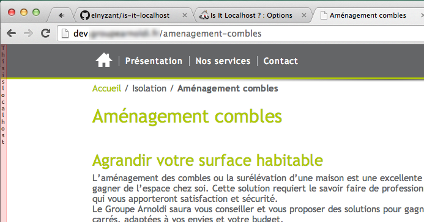
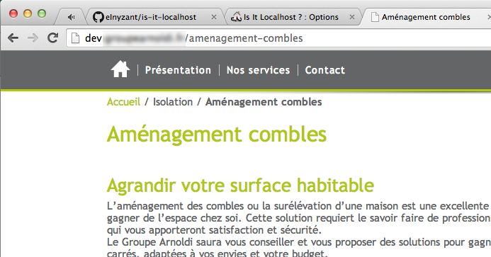

Is It Localhost ?
=================

Chrome Plugin to help you know if you are working on a localhost website or not

This Extension was realised by the [Garden Media Community](http://www.garden-media.fr "Garden Media Homepage")

## What is it for ?
As a developer, I often work on localhost : best rates, and no more need internet connection to work.
For practical reasons, I use the same domain name as the published website. So I change my hosts file to point to the local server.
 
The problem is, because you juggle between the local server and the published website, sometimes you do not remember exactly where you are actually working and a mishandling can quickly happen ... 

Is It Localhost reads the hosts file on your computer and displays a discreet little red inset on localhost websites.You need to specify in the plugin options the location of this file. Then it will create a symlink.

## Screenshots
### Working on localhost :
Do you see the small vertical red notice on the left ?



### Working on published website :




## Installation
In order this plugin correctly works you will need to create a vhost on your local server.

### Get the plugin :
Clone this repository somewhere on your local server

```
$cd /web/document/root/ 
$git clone https://github.com/eInyzant/is-it-localhost.git
```

### Create a vhost
You must create a vhost with the following domain name : 
```
is-it-locahost.local
```

Please pay attention to the correct Document root of your vhost. You must fill the folder where your plugin is installed.

Vhost example :
```
<VirtualHost *:80>
  ServerAdmin example@email.com
  DocumentRoot "/web/root/is-it-localhost/"
  ServerName is-it-localhost.local
</VirtualHost>
```

### Add entry to hosts file
In order to work, you need to add the is-it-Localhost.local domain name to your hosts file
For example :
```
127.0.0.1 is-it-localhost.local
```

### Permissions and user group
Finally, be sure you correctly set files and folders permissions. The server will need to create a symlink to the hosts file. So it need write permissions.
Usally, on apache web server the user group is set to "www-data"

